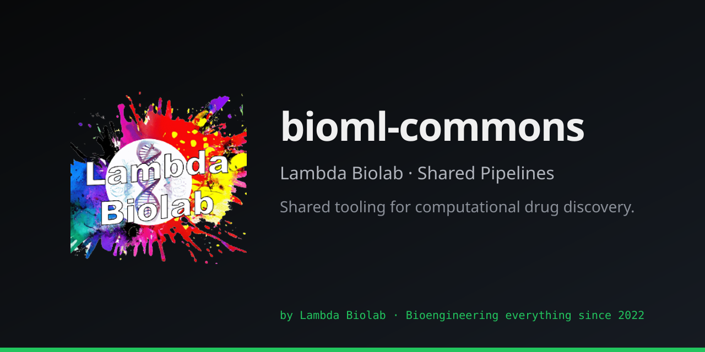

# bioml-commons



[](https://www.codefactor.io/repository/github/lambda-biolab/bioml-commons)
[](https://github.com/Lambda-Biolab/bioml-commons/actions/workflows/codeql.yml)
[](https://github.com/Lambda-Biolab/bioml-commons/network/updates)

Shared research, infrastructure, and tooling for Lambda Biolab's computational drug discovery pipelines.

## Purpose

Multiple projects ([OralBiome-AMP](https://github.com/Lambda-Biolab/OralBiome-AMP), [UTI-project](https://github.com/Lambda-Biolab/UTI-project)) share the same core toolchain: Boltz-2, AlphaFold3, OpenMM, AutoDock Vina, GNINA, RDKit, and Vast.ai cloud GPU infrastructure. This repo is the single source of truth for cross-cutting concerns.

## What belongs here

- **License & IP research** — model/tool license audits, commercial use flags
- **Architecture decisions** — ADRs for shared tooling choices
- **Shared infrastructure** (planned) — cloud GPU orchestration, Docker images, MD protocols, CI templates

## What does NOT belong here

- Project-specific pipeline code (targets, scoring, formulation)
- Domain-specific data (AMP libraries, compound libraries)
- Anything derivable from reading the project's own code or git history

## Structure

```
bioml-commons/
├── licenses/                  # License audits and compliance
│   └── model-tool-comparison.md
└── decisions/                 # Architecture decision records
    ├── adr-001-shared-repo.md
    ├── adr-002-adopt-biolab-runners.md
    ├── adr-003-adopt-vastai-gpu-runner.md
    ├── adr-004-complexity-gate-policy.md
    └── adr-005-adopt-bioml-tools.md
```

## Consumer projects

| Project | Repo | Shared tools |
|---------|------|-------------|
| OralBiome-AMP | [Lambda-Biolab/OralBiome-AMP](https://github.com/Lambda-Biolab/OralBiome-AMP) | Boltz-2, AF3, OpenMM, Vina-GPU, Vast.ai, R2 |
| UTI-project | [Lambda-Biolab/UTI-project](https://github.com/Lambda-Biolab/UTI-project) | Boltz-2, AF3, OpenMM, Vina, GNINA, Vast.ai |

## Shared packages

Cross-project code lives in dedicated pip-installable packages, not in this repo:

| Package | Repo | Purpose | Governed by |
|---------|------|---------|-------------|
| `biolab-runners` | [Lambda-Biolab/biolab-runners](https://github.com/Lambda-Biolab/biolab-runners) | Local Boltz-2 + OpenMM execution | [ADR-002](decisions/adr-002-adopt-biolab-runners.md) |
| `vastai-gpu-runner` | [Lambda-Biolab/vastai-gpu-runner](https://github.com/Lambda-Biolab/vastai-gpu-runner) | Vast.ai cloud orchestration (`BaseWorker`, `BatchOrchestrator`) | [ADR-003](decisions/adr-003-adopt-vastai-gpu-runner.md) |
| `bioml-tools` | [Lambda-Biolab/bioml-tools](https://github.com/Lambda-Biolab/bioml-tools) | Shared computational toolkit (peptide, structure, docking, selectivity, MD) | [ADR-005](decisions/adr-005-adopt-bioml-tools.md) |

## Standards

Cross-project engineering standards enforced by tooling:

- **Complexity gate:** cognitive complexity ≤15 via `complexipy` in pre-commit, ratchet-widened per project — see [ADR-004](decisions/adr-004-complexity-gate-policy.md)
